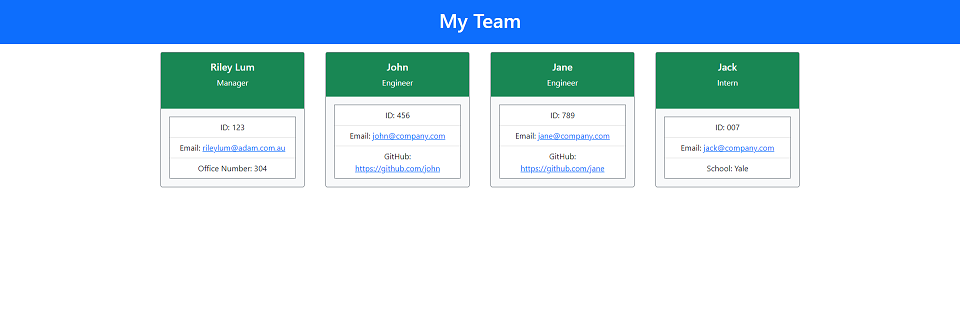

# Team Profile Tracker

  

  ## Description

  CLI Application to create static HTML pages so you can track your team's details

  ## Table of Contents

  1.[Installation Instructions](#installation-instructions)

  2.[Usage Instructions](#usage-instructions)

  3.[Contribution Instructions](#contribution-instructions)

  4.[Testing Instructions](#testing-instructions)

  5.[Questions](#questions)

  6.[License](#License)
  

  ## Installation Instructions

    npm install

  ## Usage Instructions

  RUN 

    node index 

  Follow the command prompts. An index.html file will be created in the dist/ folder

  

  

  ## Contribution Instructions

  I am not actively maintaining this project. Feel free to fork and make changes as you need

  ## Testing Instructions

    npm test

  ## Questions
  
  For any questions regarding the project please reach out to me on Github: [Github](https://github.com/riley.lum) or via Email: rileylum@adam.com.au

  ## License

  
ISC License

Copyright (c) 2021, Riley Lum

Permission to use, copy, modify, and/or distribute this software for any
purpose with or without fee is hereby granted, provided that the above
copyright notice and this permission notice appear in all copies.

THE SOFTWARE IS PROVIDED "AS IS" AND THE AUTHOR DISCLAIMS ALL WARRANTIES
WITH REGARD TO THIS SOFTWARE INCLUDING ALL IMPLIED WARRANTIES OF
MERCHANTABILITY AND FITNESS. IN NO EVENT SHALL THE AUTHOR BE LIABLE FOR
ANY SPECIAL, DIRECT, INDIRECT, OR CONSEQUENTIAL DAMAGES OR ANY DAMAGES
WHATSOEVER RESULTING FROM LOSS OF USE, DATA OR PROFITS, WHETHER IN AN
ACTION OF CONTRACT, NEGLIGENCE OR OTHER TORTIOUS ACTION, ARISING OUT OF
OR IN CONNECTION WITH THE USE OR PERFORMANCE OF THIS SOFTWARE.
        

